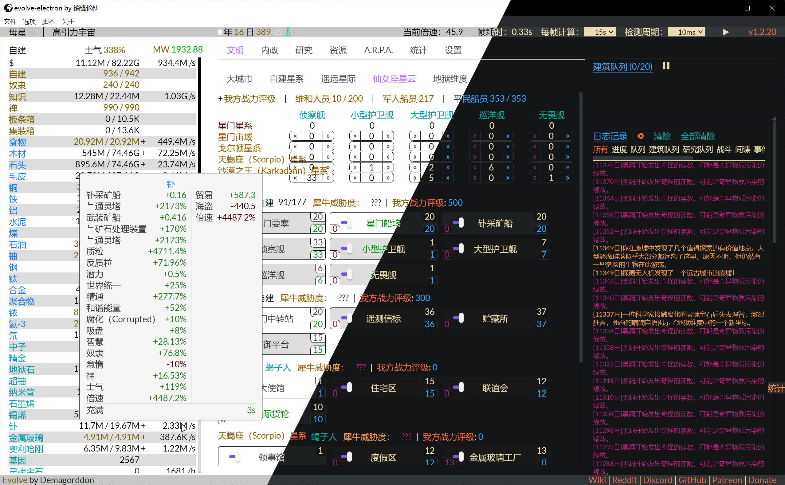

# evlove-electron
## About 关于
As the name, this is an [Electron](https://www.electronjs.org/) app that you can play [Evolve](https://github.com/pmotschmann/Evolve) in it.
如题，这是一个用于玩[Evolve](https://github.com/pmotschmann/Evolve)的[Electron](https://www.electronjs.org/)套壳软件。

Because most modern web browsers limit the web games running in the background, so I decide to resolve it by myself. I choose making the web game running in [Electron](https://www.electronjs.org/) to improve the background performance.
因为绝大部分现代浏览器对后台运行网页游戏有限制，所以我决定自己动手解决此问题，选择了[Electron](https://www.electronjs.org/)套壳来提升后台能力。

## Fetchers 特色
* Full speed in background.即使在后台也全速运行。
* Support multiple game source and provide an inside [speed-up version](https://github.com/XiaofengdiZhu/MegaEvolve).支持多种游戏来源，并提供一个内置加速版本[超进化](https://github.com/XiaofengdiZhu/MegaEvolve)。
* Support scripts with some limitations.支持脚本（有限制）。
* Light and dark theme.亮色、暗色主题。
## Download 下载
[Click here 点我](https://github.com/XiaofengdiZhu/evolve-electron/releases)
## Scripts 脚本
This feature is supported by [Tampermonkey](https://chrome.google.com/webstore/detail/tampermonkey/dhdgffkkebhmkfjojejmpbldmpobfkfo) 这个功能由[篡改猴](https://chrome.google.com/webstore/detail/tampermonkey/dhdgffkkebhmkfjojejmpbldmpobfkfo)提供支持
How to use 如何使用  
Click `脚本` button on the menubar, click `脚本设置` button, set the `Language` option to your language, click `Installed Userscripts` and add scripts.
点击菜单栏的`脚本`按钮, 点击`脚本设置按钮`按钮，设置`Language`选项为你的语言，点击`已安装的脚本`并添加脚本。
> **Attention 注意**  
> You can get scripts for MegaEvolve from here:
> 请从下面链接获取适配超进化的脚本：  
> https://github.com/XiaofengdiZhu/evolve-electron/tree/main/tampermonkeyScripts

## Screenshot 截图


## Build Commands 构建命令
1. Install dependencies. 安装依赖。
```
yarn install
```
2. Test is it ok. 测试能否正常运行。
```
yarn start
```
3. Build a installer. 构建一个安装程序。
```
yarn build
```

## Key codes 关键代码
This application use below codes to improve background performance:
这个软件使用以下代码来提升后台性能：
```js
//Prevent the application from being suspended. Keeps system active but allows screen to be turned off.
//阻止软件被暂停。保持系统活动状态，但允许屏幕关闭。 
powerSaveBlocker.start('prevent-app-suspension');
//Stop throttle animations and timers when the page becomes backgrounded.
//网页后台时不限制动画和计时器。
webContents.backgroundThrottling = false;
```